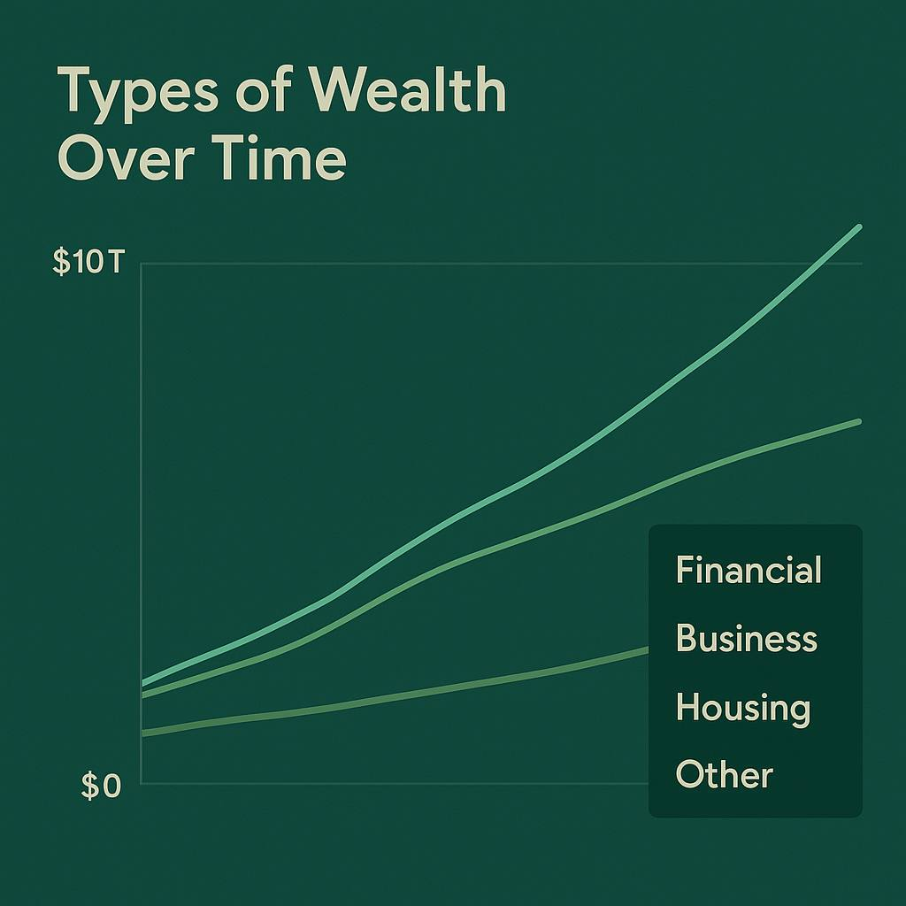
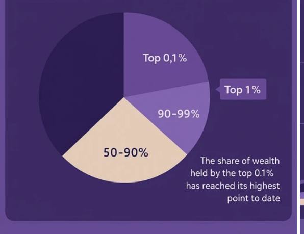

# Wealth Distribution Dashboard (WPF)

This WPF application visualizes user data using charts and integrates both local database and external API.

---

## 🧩 Features

- Stacked area chart ready (LiveCharts / Syncfusion)
- SQLite database integration (`System.Data.SQLite`)
- API data loading from jsonplaceholder.typicode.com
- Clean WPF interface with modern styling
- Lightweight `.exe` for Windows

---

## 🖼️ Screenshot

---

